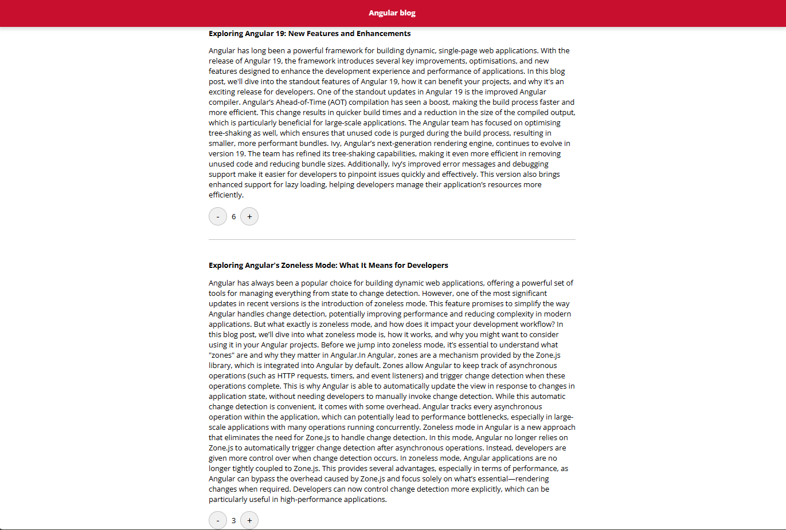
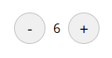
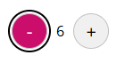

# Angular take home test

## Task

Create a fork of this project, and using the designs from the ux folder and local posts API, update the application to display blog posts and allow users to like/dislike individual posts.



Each blog post should display the number of likes with the following styles,
* border should be `#c1c1c1`
* background color should be `#f2f2f2`
* width and height of approx `40px`
* font size of `20px`



When the user interacts with the like or dislike button,
* the count value displayed should increase/decrease
* background color should change to `#cb0d6b`
* text color should changed to `#ffffff`
* a `2px` black outline should be displayed



## Backend API server

To start a local development API server, run:

```bash
npm run serve-api
```
Runs a local api providing the following endpoints,

Return a list of posts: `http://localhost:3000/posts`

Return a single post: `http://localhost:3000/posts/{id}`

## Serving Frontend Angular application

```bash
ng serve
```

Once the server is running, open your browser and navigate to `http://localhost:4200/`. The application will automatically reload whenever you modify any of the source files.
